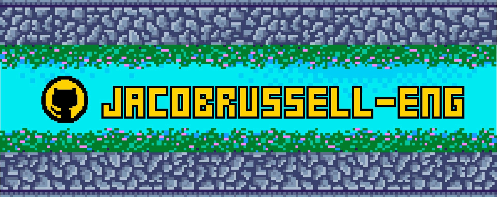

## ✌️ Hi I'm Jacob, a Systems Engineering Graduate eager to build things in Software! 
My main languages are JavaScript and Python, though I'm always eager to learn new tools and frameworks. Currently, I'm bouncing between learning Web Front-end and Back-end, with a touch of beginner game dev on the side.  Offline I like to go hiking or rockclimbing, otherwise I'm probably reading graphic novels or playing the Binding of Isaac.

<!--
**jacobrussell-eng/jacobrussell-eng** is a ✨ _special_ ✨ repository because its `README.md` (this file) appears on your GitHub profile.

Here are some ideas to get you started:

- 🔭 I’m currently working on ...
- 🌱 I’m currently learning ...
- 👯 I’m looking to collaborate on ...
- 🤔 I’m looking for help with ...
- 💬 Ask me about ...
- 📫 How to reach me: ...
- 😄 Pronouns: ...
- ⚡ Fun fact: ...
-->

<!-- #  Tech Stack: -->

## 💻 Dev Stack:
        
## 📚 Other Software:
    
<!-- Yet to be learned: -->
<!--      -->
## 📊 GitHub Stats:
<!--  -->

<!--   -->
## 🔗 Find me elsewhere:

## 🎧 Currently Listening to:
 

<!-- Proudly created with GPRM ( https://gprm.itsvg.in ) -->